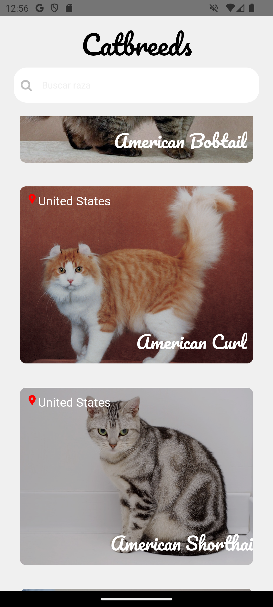
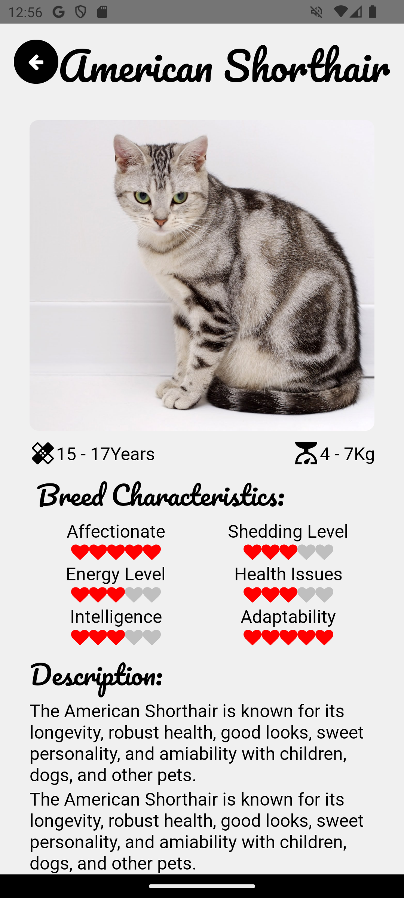

# CatBreeds 🐱

**React Native Mobile App**

CatBreeds es una aplicación móvil desarrollada en **React Native** que permite explorar información sobre distintas razas de gatos.  
El proyecto está orientado a poner en práctica buenas bases de **arquitectura, consumo de APIs y manejo de estado**, siguiendo patrones comunes en aplicaciones reales de producción.

---

## 🚀 ¿Qué demuestra este proyecto?

- Uso de arquitectura escalable y mantenible.
- Integración con una API pública real.
- Manejo de estado global.
- Navegación móvil moderna.
- Buenas prácticas en proyectos React Native.

---

## 🧠 Características técnicas

- **React Native** como framework principal.
- **Arquitectura Atómica** para una mejor organización y reutilización de componentes.
- **React Navigation** para la navegación entre pantallas.
- **Redux Toolkit** para el manejo de estado global.
- **Axios** para el consumo de servicios REST.
- Integración con la API pública:  
  https://thecatapi.com/
- **Drawer Navigation**.
- Ícono personalizado de la aplicación.

---

### 📂 Estructura del proyecto (resumen)

```bash
src/
├── components/    # Componentes reutilizables (arquitectura atómica)
├── screens/       # Pantallas de la app
├── navigation/    # Configuración de navegación
├── store/         # Redux (slices, store)
├── services/      # Lógica de consumo de API
└── utils/         # Utilidades y helpers
```

---

## 📱 Capturas de pantalla





---

## 🛠️ Instalación y ejecución

### Requisitos previos

Tener configurado correctamente el entorno de React Native:  
https://reactnative.dev/docs/set-up-your-environment

---

### 1️⃣ Instalar dependencias

```bash
# npm
npm install

# yarn
yarn install
```

---

### 2️⃣ Ejecutar la aplicación

### Android

```bash
# npm
npm run android

# yarn
yarn android
```

### iOS

Instalar dependencias nativas (solo la primera vez o tras cambios):

```bash

bundle install
bundle exec pod install
```

Ejecutar la app:

```bash
# npm
npm run ios

# yarn
yarn ios
```

Si el entorno está correctamente configurado, la aplicación se ejecutará en el emulador, simulador o dispositivo físico conectado.
También es posible compilarla directamente desde Android Studio o Xcode.
